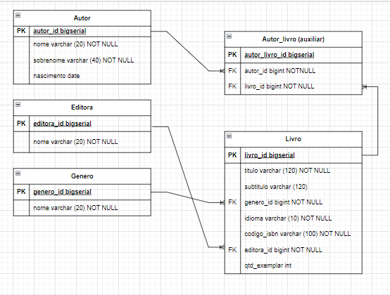

# Biblioteca Logoinha Server

## Descrição 

Este projeto trata-se do backend do sistema de gestão da biblioteca da turma Lagoinha.
Seguindo o seguinte modelo relacional:


## Como executar

Para executar este projeto você pode seguir os seguintes passos:

- Executar o comando ```git clone https://github.com/FuturoDEV-Lagoinha/projeto-biblioteca-spring.git```
- Importar o projeto na IDE de sua preferência
- Configurar as variáveis de ambiente: 
     ```
    - spring.datasource.url
    - spring.datasource.username
    - spring.datasource.password
    ```
- Exercutar a aplicação